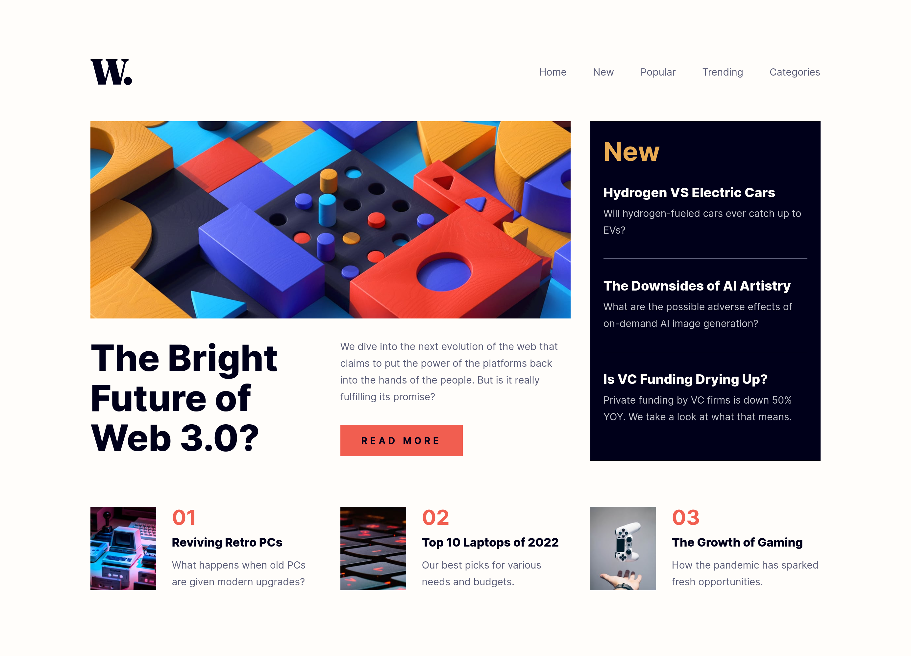

# Frontend Mentor - News homepage solution

This is a solution to the [News homepage challenge on Frontend Mentor](https://www.frontendmentor.io/challenges/news-homepage-H6SWTa1MFl). Frontend Mentor challenges help you improve your coding skills by building realistic projects.

## Table of contents

- [Overview](#overview)
  - [The challenge](#the-challenge)
  - [Screenshot](#screenshot)
  - [Links](#links)
- [My process](#my-process)
  - [Built with](#built-with)
  - [What I learned](#what-i-learned)
  - [Continued development](#continued-development)
  - [Useful resources](#useful-resources)

## Overview

### The challenge

Users should be able to:

- View the optimal layout for the interface depending on their device's screen size
- See hover and focus states for all interactive elements on the page

### Screenshot

### Links

- Solution URL: [News Homepage](https://www.frontendmentor.io/solutions/responsive-news-homepage-with-using-grid-and-subgrid-layout-lL3tqWv7-M)
- Live Site URL: [News Homepage](https://fem-news-homepage-woad.vercel.app/)

## My process

### Built with

- Semantic HTML5 markup
- CSS custom properties
- Flexbox
- CSS Grid
- Mobile-first workflow
- [Vite](https://vite.dev/guide/) - Build tool

### What I learned

- Learned about layout techniques. About using subgrid to perfectly align the content in the grid children.
- Learned about making hamburger menu and toggling it.
- Learned about providing accessibility and keyboard navigation in the case of having a hamburger menu and best practices.

### Continued development

- Learn about making hamburger menu more efficiently.
- Learn about providing accessiblity for screen readers.

### Useful resources

- [a11y](https://www.a11yproject.com/) - This helped me with accessibility best practices.
- [Hamburger menu](https://stackoverflow.com/questions/64264356/making-a-simple-hamburger-menu) - Helped me create a basic hamburger menu.
